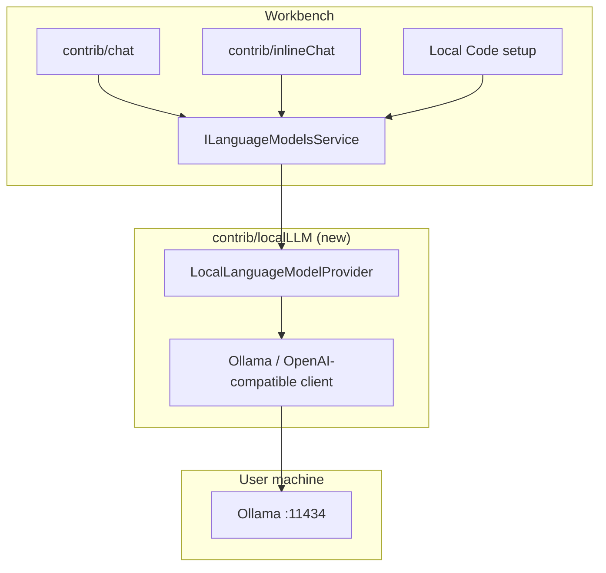

# Local Code

**Local Code** is a desktop IDE derived from [VSCodium](https://github.com/VSCodium/vscodium) (MIT build of [VS Code](https://github.com/microsoft/vscode)) oriented around **local large language models first**. Cloud/API agents are optional add-ons, not the default experience.

Build tooling lives in [`vscodium/`](vscodium/). Product implementation targets upstream VS Code **1.116.0** (see [`vscodium/upstream/stable.json`](vscodium/upstream/stable.json)), applied as patches and overlays during `get_repo.sh` / `prepare_vscode.sh`.

Running decisions, tradeoffs, and drift from this spec are logged in [`implementation-notes.md`](implementation-notes.md).

---

## Goals

| Priority | Goal |
|----------|------|
| P0 | Chat and inline AI run against **local** inference (Ollama v1) with no sign-in |
| P0 | AI features **enabled by default**; no Copilot entitlement funnel |
| P0 | Provider integrated in the **application core** (workbench), not a marketplace extension users must install |
| P1 | Inline chat uses the same local models as the Chat view |
| P1 | Tool use for workspace-safe operations (read/search files, diagnostics) |
| P2 | Optional cloud models (OpenAI-compatible URL) behind explicit settings |
| P2 | Optional **implicit context** (indexing / relevance) — see below |
| P3 | Custom `agentHost` provider for multi-step local agents |

## Non-goals (initial releases)

- Parity with GitHub Copilot or Cursor cloud agents
- Bundling model weights or a full GPU inference stack inside the installer
- Supporting every local runtime on day one (Ollama + OpenAI-compatible URL first)

---

## Context: implicit vs explicit

### Short answer

**Out of the box, Local Code will behave like VS Code Chat: mostly explicit context.** The heavy **implicit** context Cursor users expect (automatic codebase awareness, semantic @-codebase, aggressive relevant-file injection) is **largely Cursor’s harness**, not something VS Code OSS gives you for free—especially after Copilot is removed from the VSCodium build.

We **will** add optional implicit context over time; it is a **product layer we own**, not a free side effect of wiring Ollama.

### What Cursor does (implicit-heavy)

- Indexes the workspace and retrieves semantically related chunks without the user attaching every file
- Often includes open editors, recent edits, and broad project signal in the prompt
- Tight coupling between editor state and the agent loop

Much of this is **proprietary to Cursor** and is **not** present in the stock `contrib/chat` stack VSCodium ships.

### What VS Code 1.116 provides (explicit-first)

- User-driven context: `@` mentions, file/selection attachments, symbols, prompts
- `ILanguageModelsService` + tools/MCP for structured capabilities
- Copilot (removed in our build) previously supplied codebase indexing and default agent wiring

With Copilot removed, **explicit attachments are the default** unless we implement retrieval ourselves.

### Local Code direction

| Phase | Context model |
|-------|----------------|
| **MVP** | **Explicit default** — active editor, selection, user `@file` / attachments; system prompt explains limits |
| **v1.1** | **Light implicit** — opt-in: open tabs list, workspace root tree summary, `git status` / diff summary (no embeddings) |
| **v1.2+** | **Deep implicit (opt-in)** — local embeddings (e.g. Ollama `nomic-embed-text`), sqlite/vector store, “include relevant files” before send |

Settings will make implicit behavior **obvious and controllable** (e.g. `localCode.context.implicitEnabled`, token budget caps).

---

## Architecture



**Native** means: provider registers with `ILanguageModelsService` from workbench code under `src/vs/workbench/contrib/localLLM/`, maintained as VSCodium patches—not a gallery extension users install separately.

A **bundled built-in extension** may be used only as a short-lived spike; the target architecture is core contrib + patches.

---

## Repository layout

```
local-code/
├── PROJECT.md                 ← this file (spec + roadmap)
├── implementation-notes.md    ← running build/implementation log
└── vscodium/                  ← VSCodium build scripts, patches, branding
    ├── patches/user/          ← Local Code–specific patches
    ├── upstream/stable.json   ← pinned VS Code version
    └── vscode/                ← cloned upstream (after get_repo.sh)
```

---

## Phased roadmap

### Phase 0 — Build loop

- [ ] `get_repo.sh` + `prepare_vscode.sh` produce `vscodium/vscode/`
- [ ] Dev build via `vscodium/dev/build.sh` (or documented subset: compile + run)
- [ ] Confirm Chat UI with AI features enabled

### Phase 1 — Product identity (VSCodium layer)

- [ ] Rebrand to **Local Code** (`nameShort`, `applicationName`, icons, data dirs)
- [ ] `chat.disableAIFeatures` default **false**; update config description (not “Copilot”)
- [ ] Replace / bypass Copilot **chat setup** with “Connect to Ollama” flow
- [ ] Set `defaultChatAgent` to Local Code’s built-in chat participant (when registered)
- [ ] Keep `extensions/copilot` removed; no GitHub sign-in path in product defaults

### Phase 2 — Core local LLM provider

- [ ] New contrib: `contrib/localLLM`
- [ ] Ollama: list models (`/api/tags`), chat stream (`/api/chat`)
- [ ] Settings: endpoint, default model, context length, request timeout
- [ ] Register with `ILanguageModelsService`; model picker in Chat

### Phase 3 — Inline chat

- [ ] Same provider for `contrib/inlineChat`
- [ ] Editor selection → inline prompt path

### Phase 4 — Tools and agents

- [ ] Workspace tools via `languageModelToolsService` (read-only first)
- [ ] Optional MCP for user-provided servers
- [ ] Later: custom `agentHost` provider for multi-step local agents

### Phase 5 — Optional cloud

- [ ] OpenAI-compatible remote endpoint; **off** by default
- [ ] UI separates “Local models” vs “Cloud models (optional)”

---

## Configuration (planned)

| Setting | Purpose |
|---------|---------|
| `localCode.ollama.endpoint` | Default `http://127.0.0.1:11434` |
| `localCode.ollama.defaultModel` | e.g. `qwen2.5-coder:7b` |
| `localCode.context.implicitEnabled` | Opt-in implicit context (later) |
| `localCode.context.maxTokens` | Cap on injected context |
| `chat.disableAIFeatures` | `false` by default in Local Code |

---

## Security and privacy

- Default endpoint: loopback only; warn if non-localhost
- No telemetry of prompts to cloud without explicit cloud model configuration
- Tool execution gated; terminal/shell tools off or confirm-first in early releases

---

## Upstream and maintenance

- Track VSCodium/VS Code releases via `upstream/stable.json`
- Local Code patches live in `vscodium/patches/user/` (and numbered patches when stable)
- Expect merge work on each VS Code minor bump (~39 upstream VSCodium patches today)

---

## Package manager

Local Code uses **pnpm** for all dependency installs. **npm is not used** for installs in this repo.

- Repo root: `packageManager` in [`package.json`](package.json)
- VS Code tree: `vscodium/prepare_vscode.sh` runs `pnpm import` (if needed) and `pnpm install --frozen-lockfile`
- Node: **22.22.1** via **fnm** ([`.node-version`](.node-version), [`scripts/setup-env.sh`](scripts/setup-env.sh))

Upstream VS Code scripts still reference `npm run` in `package.json` script names; that is orchestration only, not `npm install`.

---

## References

- [VSCodium howto-build](vscodium/docs/howto-build.md)
- [VSCodium Copilot doc](vscodium/docs/ext-github-copilot.md) (what we are *not* shipping by default)
- VS Code: `contrib/chat`, `ILanguageModelsService`, `contrib/inlineChat`, `contrib/mcp`, `platform/agentHost`

---

## Current status

| Milestone | Status |
|-----------|--------|
| Project docs | Done — this file + [`implementation-notes.md`](implementation-notes.md) |
| VS Code source cloned | Done — `vscodium/vscode/` @ 1.116.0 |
| AI enabled by default patch | Done — `patches/user/90-local-code-enable-ai-default.patch` |
| Node **22.22.1** + **pnpm** | Done (fnm + corepack) |
| `pnpm install` (vscode deps) | **Done** (with `DEVELOPER_DIR` → Xcode.app) |
| Compile / run IDE | **Next** — `pnpm run compile` in `vscodium/vscode/` |
| `contrib/localLLM` provider | Not started |

See [`implementation-notes.md`](implementation-notes.md) for the live log.
